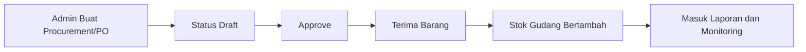

# Alur Kerja Sistem

Dokumen ini menjelaskan alur proses bisnis utama dari hulu sampai hilir.

## 1. Gambaran Umum Alur

1. Calon pelanggan melihat produk di website.
2. Calon pelanggan mengirim inquiry.
3. Admin menindaklanjuti inquiry menjadi quotation.
4. Quotation disepakati lalu dikonversi menjadi sales order.
5. Sales order diproses hingga selesai pengiriman.
6. Invoice diterbitkan dan ditagihkan.
7. Pembayaran dicatat sampai status lunas.
8. Data transaksi masuk ke laporan dan analitik.

## 2. Diagram Alur Penjualan

```mermaid
flowchart LR
    A[Website Katalog] --> B[Form Inquiry]
    B --> C[Admin Review Inquiry]
    C --> D[Buat Quotation]
    D --> E[Quotation Disetujui]
    E --> F[Konversi ke Sales Order]
    F --> G[Proses Operasional]
    G --> H[Buat Invoice]
    H --> I[Catat Pembayaran]
    I --> J[Status Lunas]
    J --> K[Laporan Keuangan]
```

## 3. Diagram Alur Procurement

## 4. Alur Notifikasi dan Otomasi

- Scheduler cek stok kritis setiap hari.
- Scheduler cek invoice overdue setiap hari.
- Scheduler generate laporan bulanan setiap awal bulan.
- Queue worker memproses notifikasi dan job asinkron.

## 5. Alur Data Website dan CMS

1. Admin mengubah konten dari menu Kelola Website.
2. Data tersimpan di tabel site_contents.
3. Halaman website publik membaca konten terbaru.
4. Perubahan langsung tampil tanpa deploy ulang.

## 6. Alur Audit dan Kontrol Akses

1. User login sesuai role.
2. Permission diverifikasi pada level menu, aksi, dan policy.
3. Aktivitas penting tercatat sebagai audit log.
4. Owner/super admin dapat melakukan review lintas modul.
