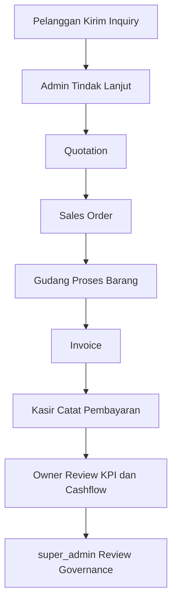

# Alur Per User

Dokumen ini menjelaskan alur penggunaan sistem untuk setiap role.

## 1. super_admin

## Tujuan

Mengelola sistem secara penuh, termasuk setup, data master, user, dan audit.

## Alur Harian

1. Login ke admin panel.
2. Cek dashboard dan notifikasi prioritas.
3. Verifikasi kelengkapan master data (produk, kategori, warehouse, supplier, user).
4. Monitoring transaksi lintas modul.
5. Review policy issue, log aktivitas, dan exception operasional.
6. Intervensi jika ada bottleneck proses.

## 2. owner

## Tujuan

Mengawasi performa bisnis, cashflow, piutang, dan keputusan strategis.

## Alur Harian

1. Login ke admin panel.
2. Cek KPI dashboard (penjualan, outstanding invoice, alert stok).
3. Review halaman Financial Report Center.
4. Review invoice overdue dan status pembayaran.
5. Review procurement/purchase order bernilai besar.
6. Validasi distribusi laba sekutu saat periode tutup buku.

## 3. admin

## Tujuan

Menjalankan proses operasional utama dari inquiry sampai pelaporan.

## Alur Harian

1. Cek inquiry baru dari website.
2. Tindak lanjuti inquiry dan buat quotation.
3. Update quotation menjadi dikirim/disepakati.
4. Konversi quotation ke sales order.
5. Pantau proses order sampai siap ditagih.
6. Buat invoice dan koordinasi pembayaran.
7. Update konten website jika diperlukan.

## 4. kasir

## Tujuan

Menangani pencatatan pembayaran dan monitoring piutang.

## Alur Harian

1. Buka menu Kasir Desk.
2. Lihat daftar invoice belum lunas.
3. Catat pembayaran (tunai/transfer/cek/giro).
4. Pastikan nominal tidak melebihi sisa bayar.
5. Monitor ringkasan kas harian dan invoice outstanding.
6. Koordinasi follow-up untuk invoice overdue.

## 5. gudang

## Tujuan

Menjaga akurasi stok, pergerakan barang, dan penerimaan barang masuk.

## Alur Harian

1. Cek alert stok kritis.
2. Input stok masuk atau adjustment bila ada penerimaan.
3. Review stock movement untuk validasi mutasi.
4. Proses penerimaan procurement/purchase order approved.
5. Pastikan stok produk sinkron sebelum order diselesaikan.

## 6. Alur Interaksi Antar User

