# Screenshoot Gambar

Dokumen ini berisi daftar screenshot wajib untuk dokumentasi sistem.

Catatan:

- Folder gambar: docs/screenshots
- File saat ini berupa placeholder agar struktur dokumentasi siap pakai.
- Silakan ganti setiap file placeholder dengan screenshot asli dari aplikasi.

## 1. Daftar Screenshot Website Publik

1. Halaman beranda publik.
2. Halaman katalog produk.
3. Halaman detail produk.
4. Halaman kontak + form inquiry.

## 2. Daftar Screenshot Dashboard Admin

1. Halaman login admin.
2. Dashboard utama (widget KPI).
3. Modul produk/kategori.
4. Modul inquiry.
5. Modul quotation.
6. Modul sales order.
7. Modul invoice.
8. Halaman Kasir Desk.
9. Halaman Financial Report Center.
10. Halaman Kelola Website.

## 3. Gallery

## Login Admin

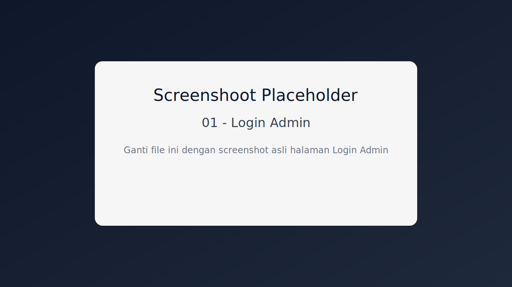

## Dashboard Admin

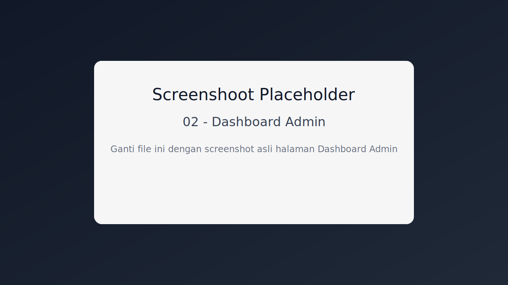

## Produk dan Kategori

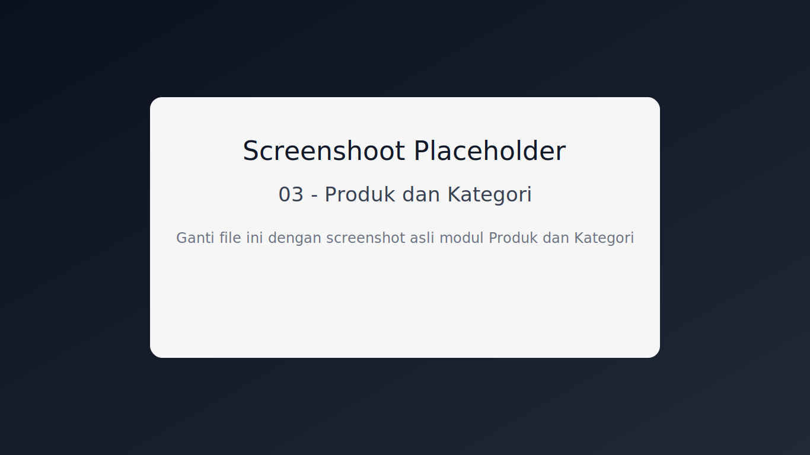

## Inquiry

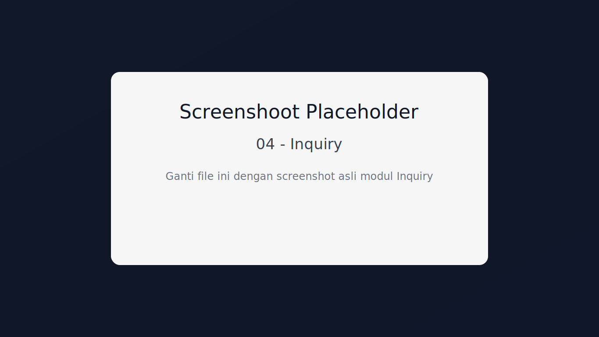

## Quotation

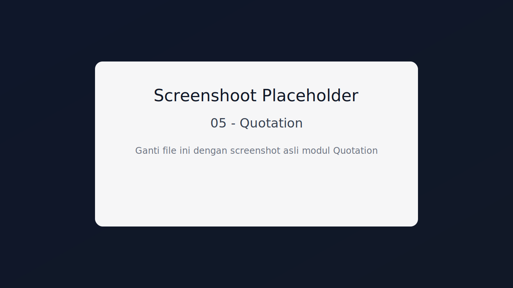

## Sales Order

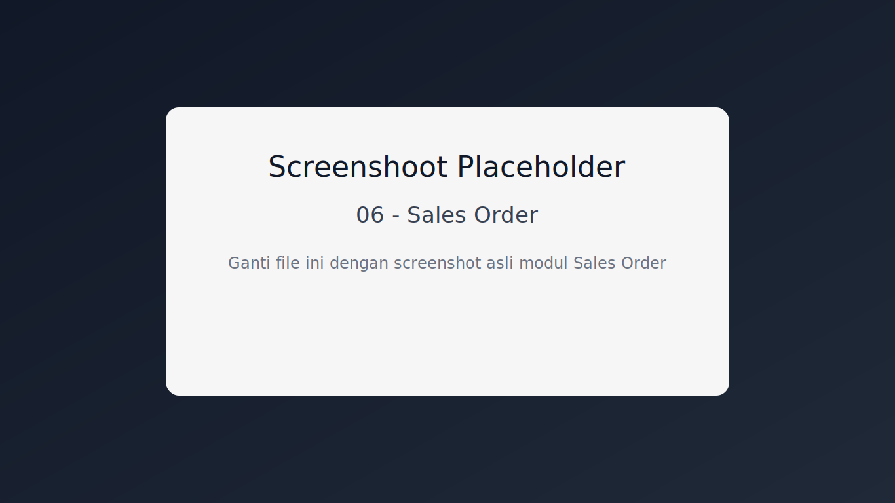

## Invoice

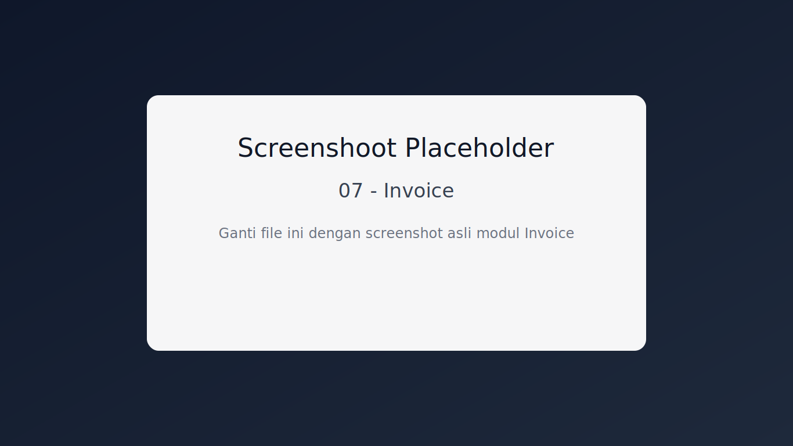

## Kasir Desk

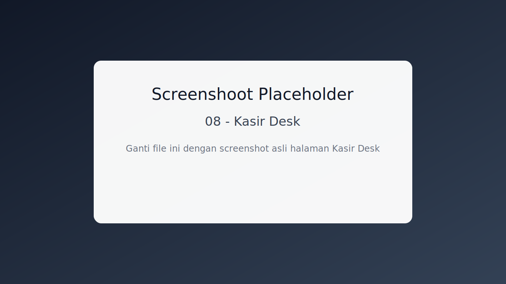

## Financial Report Center

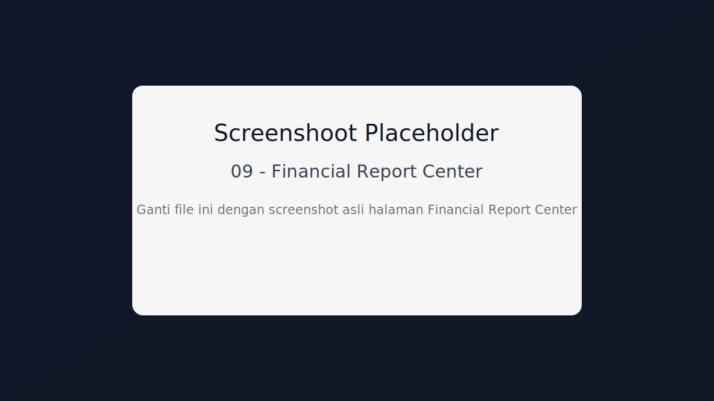

## Kelola Website

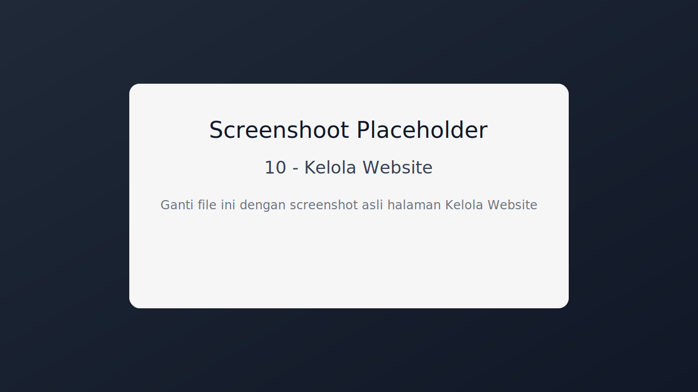

## Beranda Publik

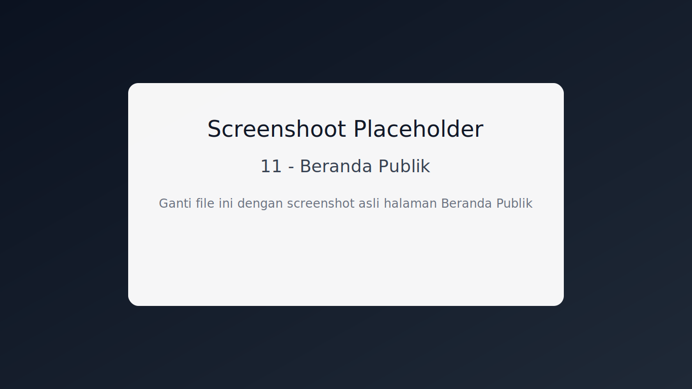

## Katalog Publik

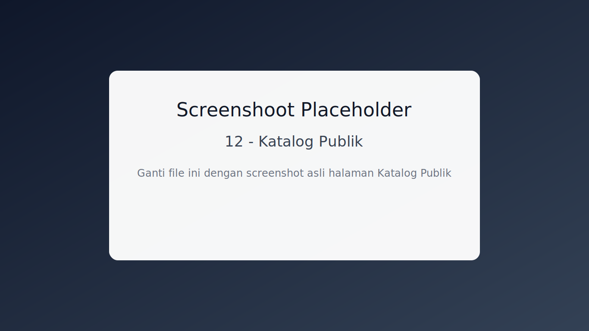

## Kontak Publik

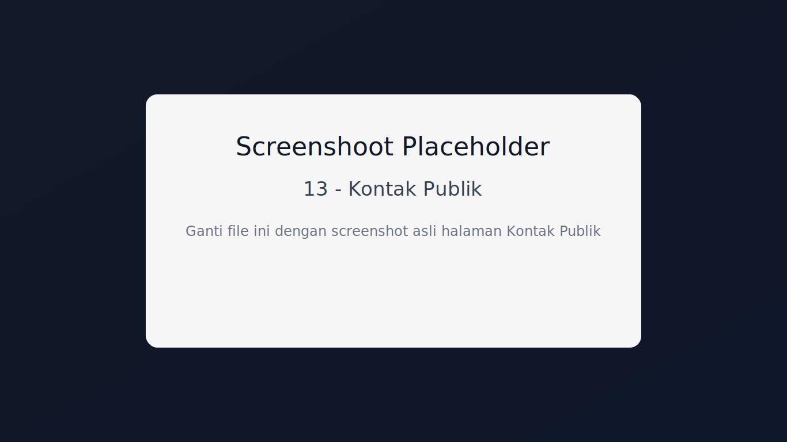

## 4. Panduan Penggantian Placeholder

1. Ambil screenshot real sesuai judul.
2. Simpan dengan nama file yang sama agar tautan tetap aktif.
3. Jika format ingin PNG, boleh ganti file extension dan update link pada dokumen ini.
4. Resolusi disarankan minimal 1366x768 untuk desktop, dan tambah screenshot mobile jika diperlukan.
