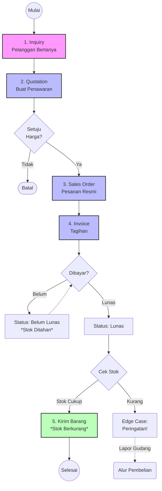

# Modul 1: Alur Penjualan (Sales) & Kas Masuk

Proses Penjualan pada sistem ini didesain bertahap agar tidak ada pesanan fiktif yang terlanjur mengeluarkan barang dari gudang. Proses ini wajib dikelola oleh tim Sales dan Kasir secara berurutan.

## 📊 Flowchart Proses Penjualan

## 📝 Panduan Penggunaan Langkah-demi-Langkah (Step-by-Step)

### Tahap 1: Membuat Inquiry (Pertanyaan Pelanggan)
**Kapan digunakan:** Saat pelanggan menghubungi via WhatsApp/Telepon untuk menanyakan harga atau ketersediaan stok.
1. Buka *Sidebar* sebelah kiri, klik menu **Penjualan**.
2. Klik sub-menu **Inquiry**.
3. Di pojok kanan atas, klik tombol **+ New Inquiry** (atau *Create Inquiry*).
4. **Isi Formulir:**
   - **Pelanggan:** Ketik dan cari nama pelanggan. (Jika pelanggan baru, Anda bisa membuat data pelanggan baru melalui menu *Master Data > Customers* terlebih dahulu).
   - **Tanggal:** Biarkan terisi otomatis (hari ini).
   - **Estimasi Kebutuhan:** (Opsional) Kapan kira-kira barang ini dibutuhkan.
   - **Produk:** Klik tombol **Add Item** di bagian bawah, lalu pilih produk yang ditanyakan (Misal: Mata Bor 12mm), dan masukkan kuantitas (Qty) yang ditanyakan.
   - **Catatan Tambahan:** Ketik pesan pelanggan, misalnya: "Minta tolong dicek apakah bisa dikirim besok?".
5. Klik tombol **Create** (Simpan). Status dokumen kini adalah `Baru`.

### Tahap 2: Membuat Quotation (Penawaran Harga)
**Kapan digunakan:** Jika pelanggan meminta surat penawaran harga resmi.
1. Masih di halaman detail *Inquiry* yang baru Anda buat, Anda bisa menggunakan Action **Buat Quotation**, ATAU:
2. Buka menu **Penjualan > Quotation**.
3. Klik tombol **+ New Quotation**.
4. **Isi Formulir:**
   - Pilih *Inquiry* sebelumnya (jika ada) agar datanya tertarik otomatis.
   - **Diskon:** Masukkan nominal diskon jika Anda ingin memberikan potongan harga (format angka langsung, bukan persen).
   - **Pajak (PPN):** Jika ada pajak, masukkan nominal pajak.
   - Pastikan rincian barang sudah benar dan harganya sesuai.
5. Klik **Create**. Statusnya kini adalah `Draft`.
6. Untuk mengirim PDF ke pelanggan: Klik nama Quotation di tabel, lalu klik tombol aksi **Print/Download PDF**. Kirim file tersebut via WhatsApp.

### Tahap 3: Meresmikan Pesanan (Sales Order)
**Kapan digunakan:** Pelanggan membalas: "Oke, saya setuju, tolong diproses ya!".
1. Buka menu **Penjualan > Quotation**.
2. Cari dokumen *Quotation* yang sudah disetujui, lalu klik untuk melihat detailnya.
3. Klik tombol aksi **Approve**. Status berubah menjadi `Approved`.
4. Setelah itu, akan muncul tombol aksi baru bernama **Convert to Sales Order**. Klik tombol tersebut.
5. Konfirmasi pesan *pop-up*. Sistem akan otomatis membuat data di tabel *Sales Order*.
6. Buka menu **Penjualan > Sales Order**. Anda akan melihat SO baru berstatus `Draft`.
7. Klik tombol aksi **Approve** pada SO tersebut. Pada titik ini, pesanan sudah resmi mengikat.

### Tahap 4: Menagih & Menerima Pembayaran (Invoice)
**Kapan digunakan:** Saat barang siap dan Anda harus menagih pembayaran (atau jika kasir menerima transfer).
1. Di halaman *Sales Order* yang sudah `Approved`, klik tombol **Buat Invoice**.
2. Buka menu **Penjualan > Invoice** untuk melihat tagihannya.
3. Kirim tagihan ke pelanggan menggunakan tombol **Kirim WA** (otomatis membuka WhatsApp Web).
4. **Mencatat Pembayaran:**
   - Klik nama/nomor Invoice untuk masuk ke halaman detail.
   - Di bagian bawah, ada tabel **Payments (Pembayaran)**.
   - Klik **Create Payment**.
   - Masukkan *Tanggal* pembayaran, *Nominal Uang* yang ditransfer, dan *Metode* (misal: Transfer Bank BCA).
   - Upload *Bukti Transfer* pada kolom bukti (opsional tapi disarankan).
   - Klik **Save**.
5. **EFEK SISTEM:** Jika total *Payment* sudah menyentuh (atau melebihi) total Invoice, status Invoice akan langsung berubah menjadi **`Lunas`**.

### Tahap 5: Pengiriman Barang (Otomatis)
1. Perlu diketahui bahwa **Stok barang di gudang TIDAK AKAN berkurang** selama Invoice belum berstatus `Lunas`.
2. Detik dimana Anda mencatat pembayaran hingga lunas, sistem secara otomatis langsung:
   - Mencatatnya sebagai **Kas Masuk** di Laporan Keuangan.
   - **Memotong stok fisik** di gudang yang terhubung.
3. Anda (atau pihak gudang) tinggal mencetak Invoice/Surat Jalan dan memproses pengiriman fisik barang ke pelanggan.

## ⚠️ Edge Cases (Kasus Khusus / Masalah Umum)

- **Kasus 1: Pelanggan membatalkan pesanan di tengah jalan.**
  - **Langkah UI:** Buka halaman Quotation atau Sales Order yang ingin dibatalkan. Klik ikon tiga titik (Actions) atau tombol di pojok kanan bernama **Batalkan (Cancel)**. Status akan berubah merah menjadi `Cancelled`. 
  - *Catatan:* Jika sudah masuk Invoice dan dibatalkan, Invoice tersebut tidak bisa dibayar dan stok tidak akan terpotong.
- **Kasus 2: Pelanggan mau bayar Lunas, tapi ternyata barang di gudang kosong.**
  - **Apa yang terjadi:** Saat Anda mencoba klik "Save" pada form Pembayaran Invoice, sistem akan menolak dan memunculkan kotak notifikasi merah berbunyi: *"Stok produk X tidak mencukupi"*.
  - **Solusi:** Anda harus berkoordinasi dengan Gudang untuk menambah stok terlebih dahulu (Membuka modul Pembelian). Anda tidak bisa melunasi Invoice sebelum ada stok.
- **Kasus 3: Pembayaran secara dicicil (Termin).**
  - **Langkah UI:** Buka halaman Invoice, buat Payment baru, dan masukkan nominal yang HANYA sebagian dari total (misal total Rp10jt, dibayar Rp5jt).
  - **Efek:** Status Invoice akan menjadi `Sebagian` (Warna kuning). Stok belum akan dipotong hingga sisa pembayaran dilunasi di hari berikutnya.

---
**[Lanjut ke Modul Pembelian ➡️](2-Alur-Pembelian-Stok.md)**
