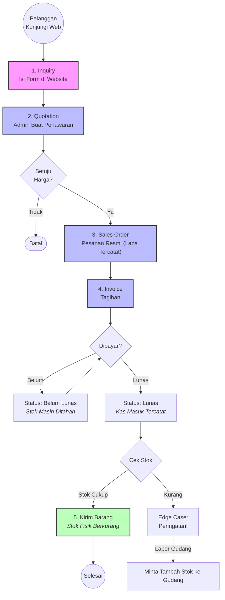

# Modul 1: Alur Penjualan (Sales) & Kas Masuk

Proses Penjualan pada sistem ini didesain bertahap agar tidak ada pesanan fiktif yang terlanjur mengeluarkan barang dari gudang. Proses ini wajib dikelola oleh tim Sales dan Kasir secara berurutan.

## 💡 Konsep Dasar yang Wajib Dipahami Admin

1. **Inquiry BUKAN dibuat oleh Admin!**
   Inquiry adalah "Kotak Masuk" (Inbox) dari _Website Publik_. Saat ada calon pembeli melihat-lihat website CV Anda dan mengisi formulir "Hubungi Kami", datanya akan otomatis terkirim ke menu Inquiry di Admin Panel dengan status `Baru`. Admin tidak bisa membuat Inquiry secara manual dari dasbor. Tugas Admin di sini adalah membaca pesan tersebut, membalasnya via WhatsApp/Email, dan menambahkan Catatan (_Notes_) atas hasil percakapan tersebut.
2. **Quotation vs Sales Order**
   - **Quotation (Penawaran):** Masih sebatas "tanya harga" dan negosiasi (belum pasti beli). Admin bisa merubah harga dan memberi diskon di tahap ini untuk diserahkan ke pelanggan dalam bentuk PDF.
   - **Sales Order (SO):** Adalah Quotation yang sudah "Deal" dan disetujui. Saat SO diterbitkan, perusahaan sudah mengikat janji untuk menjual. Laba (secara kertas/akuntansi) sudah mulai dihitung di sini.
3. **Kapan Stok Gudang Berkurang?**
   Stok di gudang **TIDAK AKAN BERKURANG** saat SO dibuat, apalagi saat Inquiry. Stok fisik hanya akan otomatis terpotong **tepat di detik** Admin / Kasir menginput pembayaran (Payment) yang membuat status Invoice menjadi **`Lunas`**.

---

## 🎬 Contoh Kasus Penggunaan (Skenario Dunia Nyata)

Mari kita bayangkan skenario seorang pelanggan yang ingin membeli barang di CV Anda:

- **Pelanggan Mengisi Form di Website:** Pelanggan masuk ke website profil perusahaan Anda, melihat-lihat katalog produk, lalu mengisi Formulir Hubungi Kami atau Minta Penawaran. Mereka mengetikkan Nama, Email, Nomor Telepon, dan produk apa yang mereka butuhkan.
- **Masuk ke Dasbor Admin:** Begitu pelanggan menekan tombol *Submit* di website, datanya akan langsung "masuk" ke tabel Inquiry di Admin Panel Anda dengan status merah: `Baru`.
- **Bagaimana Admin Menjawabnya?**
  - Di dasbor, Admin bisa membaca pesannya, lalu mengklik tombol **Tandai Dibaca**.
  - Admin kemudian menghubungi pelanggan tersebut secara langsung (via WhatsApp atau membalas Email yang tertera di sistem).
  - Selama proses tawar-menawar (bolak-balik) via WA/Email, Admin bisa terus memperbarui kolom **"Catatan Admin"** di halaman Edit Inquiry tersebut agar rekan kerja lain tau progress-nya sampai mana (Misal: *"Sudah ditelepon tgl 12, masih mikir-mikir"*). Statusnya bisa diubah menjadi `Ditindaklanjuti`.
- **Jika Pelanggan Bertanya Lagi / Beli Lagi Nanti:**
  - Jika mereka mengisi form website lagi minggu depan, sistem akan membuat dokumen *Inquiry* baru.
  - Jika mereka cuma *nge-chat* via WA melanjutkan dari obrolan yang lama, Admin tidak perlu membuat *Inquiry* baru, melainkan langsung saja melompat ke tahap membuatkan **Quotation** (Penawaran Resmi) berdasarkan chat tersebut, atau meng-edit catatan yang lama.

---

## 📊 Flowchart Proses Penjualan

## 📝 Panduan Penggunaan Langkah-demi-Langkah (Step-by-Step)

### Tahap 1: Merespons Inquiry (Pertanyaan Pelanggan)

1. Buka _Sidebar_ sebelah kiri, klik menu **Penjualan > Inquiry**.
2. Anda akan melihat daftar pertanyaan dari pelanggan di website. Klik salah satu yang berstatus `Baru`.
3. Di dalam halamannya, klik tombol **Tandai Dibaca** agar rekan tim lain tahu pesan ini sedang Anda urus.
4. Hubungi nomor/email pelanggan tersebut (di luar sistem). Tanyakan detail kebutuhan mereka.
5. Sambil bernegosiasi, Anda bisa mengedit Inquiry (klik tombol pensil/Edit) dan mengetik hasil obrolan di kolom **Catatan Admin**.

### Tahap 2: Membuat Quotation (Penawaran Harga)

**Kapan digunakan:** Pelanggan minta surat penawaran harga resmi (PDF).

1. Di halaman _Inquiry_ tadi, klik tombol **Buat Quotation**. Sistem akan otomatis menarik data produk yang ditanyakan.
2. **Isi Formulir Quotation:**
   - **Diskon:** Masukkan nominal diskon jika Anda ingin memberikan potongan harga.
   - **Pajak (PPN):** Masukkan pajak jika ada.
   - Pastikan harga per unit sudah benar.
3. Klik **Create**. Statusnya kini adalah `Draft`.
4. Untuk mengirim PDF ke pelanggan: Klik nama Quotation di tabel, lalu klik tombol **Print/Download PDF**. Kirimkan via WhatsApp.

### Tahap 3: Meresmikan Pesanan (Sales Order)

**Kapan digunakan:** Pelanggan membalas: "Oke, saya setuju, tolong diproses ya!".

1. Buka menu **Penjualan > Quotation**.
2. Cari dokumen _Quotation_ yang sudah disetujui, klik untuk melihat detailnya.
3. Klik tombol aksi **Approve** (Dokumen menjadi sah).
4. Klik tombol **Convert to Sales Order**.
5. Buka menu **Penjualan > Sales Order**. Anda akan melihat SO baru berstatus `Draft`.
6. Klik tombol aksi **Approve** pada SO tersebut. Pada titik ini, laba perusahaan (Accrual Basis) sudah bertambah di dasbor Keuangan.

### Tahap 4: Menagih & Menerima Pembayaran (Invoice)

1. Di halaman _Sales Order_ yang sudah `Approved`, klik tombol **Buat Invoice**.
2. Buka menu **Penjualan > Invoice**. Kirim tagihan ke pelanggan menggunakan tombol **Kirim WA** (otomatis membuka WhatsApp Web).
3. **Mencatat Uang Masuk:**
   - Masuk ke detail Invoice, gulir ke bawah ke tabel **Payments (Pembayaran)**.
   - Klik **Create Payment**.
   - Masukkan _Tanggal_ transfer, _Nominal Uang_, dan _Metode_ (misal: Bank BCA).
   - Klik **Save**.
4. Jika total _Payment_ sama/lebih dari tagihan, status Invoice berubah menjadi **`Lunas`**.

### Tahap 5: Pengiriman Barang (Otomatis)

Detik dimana Invoice berubah status menjadi `Lunas`, sistem secara otomatis langsung:

- Mencatatnya sebagai **Kas Masuk** di Laporan Arus Kas.
- **Memotong stok fisik** di gudang yang terhubung.
  Anda tinggal mencetak Invoice/Surat Jalan dan memproses pengiriman fisik barang ke pelanggan.

## ⚠️ Edge Cases (Kasus Khusus / Masalah Umum)

- **Kasus 1: Pelanggan membatalkan pesanan di tengah jalan.**
  - **Langkah UI:** Buka halaman Quotation atau Sales Order yang ingin dibatalkan. Klik tombol aksi **Batalkan (Cancel)**. Status akan berubah merah menjadi `Cancelled`.
- **Kasus 2: Pelanggan mau bayar Lunas, tapi ternyata barang di gudang kosong.**
  - **Apa yang terjadi:** Saat Anda klik "Save" pada form Pembayaran Invoice, sistem akan memblokir dan memunculkan notifikasi merah: _"Stok produk X tidak mencukupi"_.
  - **Solusi:** Anda harus berkoordinasi dengan Gudang untuk menambah stok (Modul Pembelian). Anda tidak bisa melunasi Invoice sebelum ada stok fisik di gudang.
- **Kasus 3: Pembayaran secara dicicil (Termin).**
  - **Langkah UI:** Di form Payment, masukkan nominal yang _HANYA_ sebagian dari total tagihan.
  - **Efek:** Status Invoice akan menjadi `Sebagian` (Kuning). Stok Gudang BELUM akan dipotong hingga sisa cicilan dilunasi 100%.

---

**[Lanjut ke Modul Pembelian ➡️](2-Alur-Pembelian-Stok.md)**
