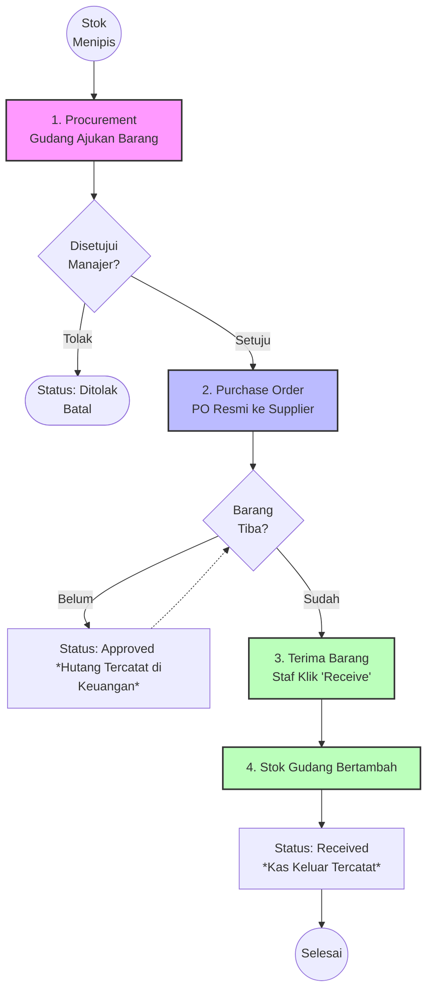

# Modul 2: Alur Pembelian (Purchasing) & Kas Keluar

Alur Pembelian dan Pengadaan mengatur bagaimana perusahaan menambah stok barang ke dalam gudang dari Supplier eksternal. Sistem ini melindungi agar Admin Gudang tidak bisa sembarangan membelanjakan uang tanpa persetujuan dari level Manajer.

## 💡 Konsep Dasar yang Wajib Dipahami Admin

1. **Procurement vs Purchase Order (PO)** 
   Mengapa pengadaan dibagi dua? Karena tidak semua orang punya wewenang mengeluarkan uang. 
   - **Procurement:** Adalah "Surat Pengajuan" (Proposal) dari staf gudang kepada manajernya. Di tahap ini, perusahaan belum berhutang ke siapapun dan belum memesan barang ke supplier mana pun. 
   - **Purchase Order (PO):** Adalah "Surat Sakti" (Pesanan Resmi) kepada Supplier. Ini hanya bisa dibuat oleh Manajer (atau yang punya hak akses). Begitu PO di-*Approve*, perusahaan sudah terikat hutang ke Supplier tersebut.
2. **Kapan Uang Kas Benar-benar Keluar?**
   Saat PO di-Approve, itu baru dihitung sebagai **Hutang**. Uang kas perusahaan baru dicatat benar-benar keluar (pada Laporan Arus Kas) persis pada saat staf gudang mengklik tombol **Terima Barang (Receive)**. Di aplikasi ini, penerimaan fisik barang diasumsikan berbarengan dengan pelunasan tunai ke Supplier.

---

## 🎬 Contoh Kasus Penggunaan (Skenario Dunia Nyata)

Mari kita bayangkan skenario ketika stok sebuah barang menipis:

- **Gudang Bertindak (Membuat Procurement):** Admin Gudang melihat fisik stok *Mesin Las* tersisa 0 unit karena baru saja diborong pelanggan. Ia membuka menu *Procurement*, membuat pengajuan "Beli 5 Mesin Las", dan menyimpannya. Statusnya kini adalah `Draft` (Menunggu Persetujuan).
- **Manajer Mengontrol Uang (Membuat PO):** Sore harinya, Manajer mengecek sistem. Ia melihat ada pengajuan dari Gudang. Manajer mengklik "Approve" pada pengajuan tersebut, lalu mengklik tombol **Buat Purchase Order**. Manajer memilih Supplier langganan (*PT Baja Sentosa*) dan mengecek harganya. Setelah disetujui, Manajer mengirimkan rincian PO via tombol "Kirim WA" ke kontak PT Baja Sentosa.
- **Barang Datang (Receive & Kas Keluar):** 3 hari kemudian, truk PT Baja Sentosa tiba di gudang. Staf gudang mengecek isi muatan, dan ternyata benar ada 5 unit mesin las. Staf gudang buka sistem, mencari PO tersebut, lalu mengklik tombol **Terima Barang** (*Receive*). 
- **Efek Sistem:** DETIK ITU JUGA, stok mesin las di sistem otomatis bertambah menjadi 5 unit, dan bagian Keuangan mencatat bahwa perusahaan baru saja mengeluarkan uang kas tunai untuk melunasi kulakan tersebut.

---

## 📊 Flowchart Proses Pembelian (Procurement)

## 📝 Panduan Penggunaan Langkah-demi-Langkah (Step-by-Step)

### Tahap 1: Mengajukan Procurement (Permintaan Pembelian)
**Siapa:** Staf Gudang / Inventory
1. Buka *Sidebar* sebelah kiri, klik menu **Produk & Stok > Procurement**.
2. Di kanan atas, klik tombol **+ New Procurement**.
3. **Isi Formulir Pengajuan:**
   - **Tujuan Gudang:** Pilih gudang mana yang akan menerima stok ini nantinya (misal: Gudang Utama Jakarta).
   - **Estimasi Dibutuhkan:** Pilih tanggal deadline barang harus ada (opsional).
   - **Produk:** Klik tombol **Add Item**, pilih barang yang mau dibeli, lalu masukkan Kuantitas (Berapa banyak yang diminta).
   - **Alasan Pengajuan:** Tulis alasannya, misal: "Sisa 1 unit di gudang, persiapan proyek bulan depan".
4. Klik **Create** (Simpan). Pengajuan kini masuk antrean berstatus `Menunggu Persetujuan` (*Draft*).

### Tahap 2: Menyetujui & Menerbitkan Purchase Order (PO)
**Siapa:** Manajer / Bagian Purchasing / Owner
1. Buka menu Procurement tadi. Cari pengajuan dari gudang yang masih menunggu.
2. Klik tombol aksi **Approve** di bagian atas kanan. Pengajuan disahkan!
3. Setelah disahkan, klik tombol biru **Buat Purchase Order**. Anda akan dialihkan ke form PO.
4. **Isi Formulir PO:**
   - **Supplier:** WAJIB diisi! Pilih dari daftar Supplier tempat CV biasa berbelanja.
   - **Cek Harga:** Pastikan harga satuan barang sudah betul. Anda bisa menyesuaikan nominal jika Supplier memberi diskon atau ada PPN di form bagian bawah.
5. Klik **Create**.
6. Buka menu **Produk & Stok > Purchase Order**.
7. Klik PO tersebut, lalu klik aksi **Approve**. Selamat, PO sudah sah.
8. (Opsional) Klik aksi **Kirim WA** untuk mengirim ringkasan pesanan langsung ke nomor WhatsApp supplier (otomatis buka WA Web).

### Tahap 3: Menerima Barang & Melunasi Pembayaran
**Siapa:** Staf Gudang / Bagian Keuangan
1. Buka menu **Purchase Order**.
2. Cari PO yang berstatus `Approved`. 
3. Ketika truk dari supplier datang membawa barang, staf harus menghitung fisik barang. Jika pas, klik tombol aksi berwarna hijau yang bergambar panah ke bawah (**Terima Barang** / **Receive**).
4. Klik **Confirm**.
5. **EFEK SISTEM (Sangat Penting):** 
   - Status PO berubah menjadi `Received`. 
   - Jumlah stok di master data Gudang **langsung bertambah**.
   - Hutang perusahaan dianggap lunas, dan sistem mencatat transaksi tersebut ke dalam **Kas Keluar** di Laporan Arus Kas.

## ⚠️ Edge Cases (Kasus Khusus / Masalah Umum)

- **Kasus 1: Barang yang datang ternyata kurang dari yang dipesan (Supplier kehabisan stok).**
  - **Langkah UI:** JANGAN KLIK 'RECEIVE'! Jika PO sudah terlanjur di-Approve, batalkan ke `Draft` dulu, lalu klik ikon **Edit**. Ganti nilai Qty (Kuantitas) menjadi sesuai yang benar-benar dibawa oleh truk Supplier. Setelah diedit, barulah klik Approve lalu klik 'Receive' agar stok yang masuk ke sistem akurat.
- **Kasus 2: Nomor WhatsApp Supplier tidak jalan saat diklik tombol "Kirim WA".**
  - **Solusi:** Buka menu *Master Data > Suppliers*. Edit profil supplier tersebut. Pastikan nomor telepon diawali dengan kode negara `62` (misal: `628123456789`) tanpa ada spasi atau tanda plus (+).
- **Kasus 3: Manajer menolak pengajuan Procurement karena budget menipis.**
  - **Langkah UI:** Di halaman detail Procurement, Manajer cukup mengklik tombol aksi **Batalkan (Cancel)**. Pengajuan tersebut akan berubah merah dan tidak bisa dilanjutkan lagi.

---
**[⬅️ Kembali ke Alur Penjualan](1-Alur-Penjualan.md)** | **[Lanjut ke Modul Keuangan & Bagi Hasil ➡️](3-Alur-Keuangan-Bagi-Hasil.md)**
