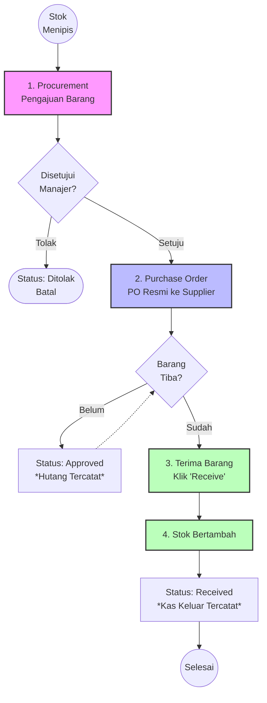

# Modul 2: Alur Pembelian (Purchasing) & Kas Keluar

Alur Pembelian dan Pengadaan mengatur bagaimana perusahaan menambah stok barang ke dalam gudang dari Supplier eksternal. Sistem ini melindungi agar Admin Gudang tidak bisa sembarangan membelanjakan uang tanpa persetujuan dari level Manajer.

## 📊 Flowchart Proses Pembelian (Procurement)

## 📝 Panduan Penggunaan Langkah-demi-Langkah (Step-by-Step)

### Tahap 1: Mengajukan Procurement (Permintaan Pembelian)
**Kapan digunakan:** Ketika staff gudang melihat fisik barang mulai habis, atau ada pelanggan mau beli tapi stok kosong di sistem.
1. Buka *Sidebar* sebelah kiri, klik menu **Produk & Stok**.
2. Pilih sub-menu **Procurement**.
3. Di kanan atas, klik tombol **+ New Procurement**.
4. **Isi Formulir:**
   - **Tujuan Gudang:** Pilih gudang mana yang akan menerima stok ini nantinya.
   - **Estimasi Dibutuhkan:** Pilih tanggal kapan barang ini paling lambat harus ada (opsional).
   - **Produk:** Klik **Add Item**, pilih barang yang ingin dipesan (misal: Kompresor) dan masukkan Kuantitas pengajuan. Anda bisa mengajukan banyak produk sekaligus.
   - **Alasan Pengajuan:** Ketik alasan, misalnya "Stok fisik sisa 1, butuh restock untuk proyek bulan depan".
5. Klik **Create** (Simpan). Status pengajuan akan menjadi `Menunggu Persetujuan` (*Draft*).

### Tahap 2: Menyetujui & Menerbitkan Purchase Order (PO)
**Kapan digunakan:** Manajer (atau staf dengan hak akses khusus) mem-verifikasi ajuan gudang dan mengirimkannya ke Supplier.
1. Buka halaman Procurement tadi.
2. Klik tombol aksi **Approve** di bagian atas kanan. Status akan berubah menjadi disetujui.
3. Setelah itu, akan muncul tombol **Buat Purchase Order**. Klik tombol tersebut.
4. Anda akan diarahkan ke form pembuatan PO baru.
5. **Isi Formulir PO:**
   - **Supplier:** WAJIB diisi! Pilih dari daftar Supplier tempat Anda akan membeli barang ini. (Jika supplier baru, buat dulu di *Master Data > Supplier*).
   - Pastikan harga beli (`harga_satuan`) sudah benar. Harga ini otomatis diambil dari harga beli Master Produk, namun bisa jadi ada diskon atau tambahan pajak dari Supplier yang bisa Anda ketik di kolom PPN / Diskon.
6. Klik **Create**.
7. Buka menu **Produk & Stok > Purchase Order**.
8. Cari dokumen PO yang baru dibuat (Status masih `Draft`), klik untuk masuk ke halaman detailnya, lalu klik tombol aksi **Approve**.
9. Pada tahap ini (*Approved*), **Hutang ke Supplier** sudah tercatat di sistem Keuangan, mengartikan bahwa perusahaan punya janji bayar ke pihak luar.
10. Anda bisa klik aksi **Kirim WA** untuk mengirimkan ringkasan pesanan langsung ke nomor WhatsApp supplier.

### Tahap 3: Terima Barang (Receive)
**Kapan digunakan:** Truk dari supplier datang membawa barang pesanan, dan staf gudang memverifikasinya.
1. Buka menu **Purchase Order**.
2. Cari PO yang berstatus `Approved`. 
3. Klik tombol aksi berwarna hijau yang bergambar panah ke bawah (atau bertuliskan **Terima Barang** / **Receive**).
4. Akan muncul peringatan konfirmasi. Klik **Confirm**.
5. **EFEK SISTEM:** 
   - Status PO berubah menjadi `Received`. 
   - Jumlah stok di tabel Gudang langsung bertambah secara instan.
   - Sistem akan mencatat transaksi ini ke tabel **Kas Keluar** pada laporan arus kas bulanan.

## ⚠️ Edge Cases (Kasus Khusus / Masalah Umum)

- **Kasus 1: Barang yang datang kurang dari yang dipesan (Supplier kehabisan stok).**
  - **Langkah UI:** Saat ini sistem memproses penerimaan PO sekaligus 100%. Jangan klik 'Receive' dulu! Buka PO tersebut, klik Edit (ikon pensil), sesuaikan kuantitas (Qty) menjadi jumlah barang yang *real* datang saja. Barulah klik 'Receive' agar stok yang bertambah akurat.
- **Kasus 2: Nomor WhatsApp Supplier tidak valid saat diklik tombol "Kirim WA".**
  - **Apa yang terjadi:** Muncul pesan error merah "Nomor WhatsApp supplier belum valid."
  - **Solusi:** Buka menu *Master Data > Suppliers*, Edit supplier tersebut. Ganti nomor teleponnya menggunakan kode negara (misal: `628123456789`) tanpa spasi, angka nol di depan, atau tanda plus (+).
- **Kasus 3: Manajer menolak pengajuan Procurement (budget tidak cukup).**
  - **Langkah UI:** Di halaman Procurement, manajer bisa mengklik tombol aksi **Batalkan (Cancel)**. Pengajuan tersebut statusnya menjadi ditolak dan tidak akan pernah berlanjut menjadi PO.

---
**[⬅️ Kembali ke Alur Penjualan](1-Alur-Penjualan.md)** | **[Lanjut ke Modul Keuangan & Bagi Hasil ➡️](3-Alur-Keuangan-Bagi-Hasil.md)**
