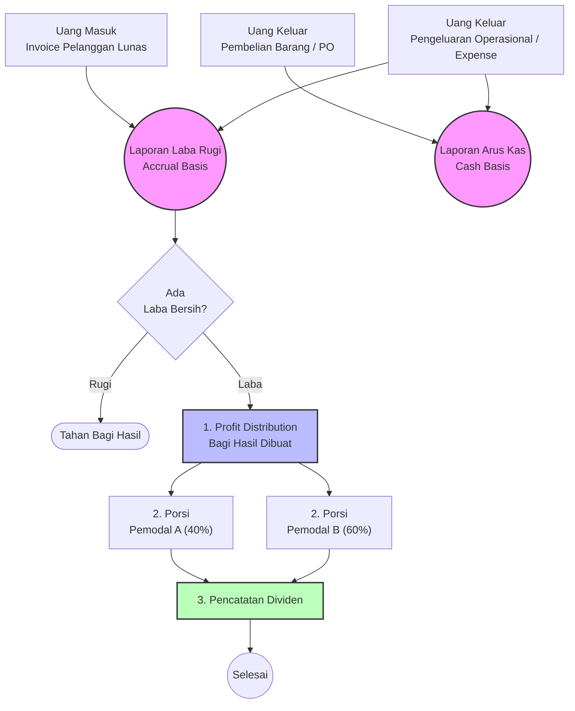

# Modul 3: Alur Laporan Keuangan & Bagi Hasil

Modul ini adalah pusat muara dari seluruh transaksi yang terjadi di Modul Penjualan dan Modul Pembelian. Di sini, Manajer dan Pemodal (Sekutu) bisa memantau dengan tepat kemana perginya uang dan seberapa besar keuntungan CV.

## 💡 Konsep Dasar yang Wajib Dipahami Admin

1. **Perbedaan Laba Rugi (Accrual) vs Arus Kas (Cash Basis)**
   - **Laba Rugi (Kinerja Bisnis):** Dihitung berdasarkan *komitmen*. Begitu Sales Order (SO) di-Approve, sistem menganggap Anda sudah mendapat penjualan, meskipun pelanggannya **belum bayar**. Ini berguna untuk melihat potensi bisnis (apakah laku atau tidak).
   - **Arus Kas (Kesehatan Tunai):** Dihitung berdasarkan *uang tunai riil*. Biarpun SO-nya miliaran, tapi kalau Invoicenya belum ada yang ditransfer (Lunas) oleh pelanggan, maka Kas Masuk Anda tetap Rp0. Ini krusial agar CV tidak kehabisan uang tunai untuk bayar supplier.
2. **Kalkulasi Pajak (Otomatis)**
   - Perusahaan bisa dikonfigurasi melalui **Pengaturan Pajak Perusahaan (Company Tax Config)**. Sistem membedakan apakah CV Anda berstatus PKP (memungut PPN 11%) atau Non-PKP, serta apakah menggunakan tarif UMKM (0,5%) atau PPh Badan Normal (22%).
3. **Mengapa Harus Ada Bagi Hasil (Profit Distribution) & Prive?**
   - Badan usaha berbentuk CV biasanya modalnya disetor oleh beberapa pemodal (Sekutu). Keuntungan bersih di akhir pembukuan dibagikan sesuai dengan persentase porsi saham.
   - **Prive:** Jika pemilik (Sekutu) ingin menarik uang di pertengahan bulan untuk keperluan pribadi, itu dicatat sebagai *Prive Withdrawal*. Prive BUKAN beban/expense (tidak memotong Laba Rugi), melainkan langsung memotong *Ekuitas* (Modal) perusahaan.

---

## 🎬 Contoh Kasus Penggunaan (Skenario Dunia Nyata)

Mari kita bayangkan skenario ketika akhir bulan tiba dan waktunya tutup buku:

- **Biaya Tak Terduga (Mencatat Expense):** Sepanjang bulan berjalan, kasir secara rutin telah mencatat biaya-biaya harian ke menu *Pengeluaran*. Misalnya: bayar token listrik 2 juta, beli kopi 100 ribu, dan servis mobil operasional 500 ribu.
- **Manajer Mengecek Dasbor:** Di tanggal 31, Manajer membuka dasbor *Financial Report Center*. Ia sedikit kaget karena membaca Laporan Laba Rugi: *"Wah Laba Bersih kita bulan ini fantastis, 50 Juta! (berdasarkan semua SO yang deal). Tapi kok di Laporan Arus Kas, uang tunainya cuma sisa 10 Juta?"*
- **Menagih Piutang:** Setelah diusut dengan melihat tabel *Piutang Pelanggan* di bawah grafik, ternyata ada 2 Pabrik besar yang *Invoice*-nya belum dilunasi. Manajer pun segera menyuruh tim Sales untuk menagih.
- **Pembagian Hasil yang Adil:** Setelah seminggu berlalu dan piutang tertagih, uang kas akhirnya sehat kembali. Owner sepakat membagikan 20 Juta sebagai dividen bulan tersebut. Bagian Keuangan membuka menu *Profit Distributions*, membuat data baru, dan memasukkan angka **20 Juta**. 
- **Efek Sistem:** Otomatis, tanpa kalkulator, sistem memecah uang tersebut menjadi jatah Pak Andi (60%) sebesar 12 Juta, dan Pak Budi (40%) sebesar 8 Juta (Sesuai porsi modal yang terdaftar). Bagian Keuangan tinggal transfer m-Banking, dan laporannya tersimpan rapi selamanya.

---

## 📊 Flowchart Laporan & Bagi Hasil (Profit Distribution)

## 📝 Panduan Penggunaan Langkah-demi-Langkah (Step-by-Step)

### Tahap 1: Pencatatan Pengeluaran Operasional (Expense) & Tarikan Prive
**Kapan digunakan:** Selain berbelanja barang ke supplier, perusahaan pasti memiliki biaya harian (Expense) seperti Listrik, Gaji Karyawan, Transport Sales, dll. Selain itu, ada *Prive* jika pemilik mengambil uang.
- **Untuk Expense (Biaya Operasional):**
  1. Buka *Sidebar* kiri, klik menu **Keuangan > Pengeluaran**.
  2. Klik tombol **+ New Expense**.
  3. Isi kategori, nominal, dan tanggal, lalu klik **Create**. Uang kas perusahaan akan berkurang dan Laba Bersih akan terpotong.
- **Untuk Prive (Penarikan Pemilik):**
  1. Buka menu **Keuangan > Penarikan Prive**.
  2. Klik **+ New Prive Withdrawal**. Pilih nama Sekutu (Pemodal) dan nominal yang ditarik.
  3. Sistem akan memvalidasi apakah jumlah tarikan melebihi "Batas Prive per Bulan" yang sudah ditetapkan. Prive **TIDAK** memotong Laba Bersih, tetapi langsung mengurangi Kas dan Modal.

### Tahap 2: Membaca Dasbor Laporan Keuangan
**Kapan digunakan:** Rapat bulanan manajer atau pemegang saham.
1. Buka menu **Keuangan > Financial Report Center**.
2. Di atas halaman, terdapat kotak *Filter Tanggal*. Pilih rentangnya (Misal: 1 Juli - 31 Juli), lalu klik tombol biru **Terapkan Filter**.
3. **Cara Membaca Metrik Dasbor:**
   - **Laba Kotor & Bersih:** Anda bisa melihat apakah secara matematis perusahaan mengalami keuntungan atau malah rugi (angka merah) setelah dipotong HPP (modal barang) dan Expense.
   - **Laporan Laba Rugi:** Rincian perhitungan Accrual Basis.
   - **Laporan Arus Kas:** Rincian uang yang benar-benar cair dan ditarik masuk/keluar dari dompet perusahaan.
   - **Tabel Piutang (Kiri Bawah):** Daftar nama pelanggan yang ngutang Invoice ke kita. Wajib ditagih!
   - **Tabel Hutang (Kanan Bawah):** Daftar supplier yang sudah nerima PO dari kita tapi barangnya belum berstatus "Received".
4. Di bagian filter, ada tombol **Export PDF**. Klik untuk mengunduh laporan PDF resmi untuk dicetak.

### Tahap 3: Membagikan Laba (Profit Distribution)
**Kapan digunakan:** Akhir tahun, atau saat Owner memutuskan untuk membagikan deviden kepada para Sekutu (Pemodal) karena Kas sedang surplus.
1. Pertama-tama, pastikan seluruh data pemodal sudah masuk di menu **Master Data > Sekutu**. Pastikan total porsi kepemilikan saham mereka berjumlah 100%.
2. Buka Dasbor *Financial Report Center*, intip berapakah angka **Laba Bersih** Anda di periode ini. Misal: Rp100.000.000.
3. Buka menu **Keuangan > Profit Distributions**.
4. Klik tombol **+ New Profit Distribution**.
5. **Isi Formulir:**
   - **Bulan & Tahun:** Pilih periode pembukuan yang sedang akan dibagi hasilkan.
   - **Total Laba:** Ketik nominal Rp100.000.000.
6. Klik **Create**.
7. **EFEK SISTEM:** 
   - Anda **tidak perlu repot menghitung kalkulator**! Sistem otomatis memecah 100 Juta tersebut menjadi jatah masing-masing pemodal (misal: Pak Budi Rp40jt dan Pak Andi Rp60jt sesuai porsi saham mereka di Master Data).
   - Klik nama dokumen tersebut di tabel untuk melihat rincian jatahnya. 
   - Anda/Bagian Keuangan tinggal melakukan transfer m-Banking berdasarkan angka yang ada di dokumen tersebut.

## ⚠️ Edge Cases (Kasus Khusus / Masalah Umum)

- **Kasus 1: Mengapa angka Laba Bersih saya miliaran (Positif), tapi angka Arus Kas saya minus?**
  - **Penjelasan (PENTING):** Ini fenomena yang paling sering menjebak bisnis B2B. Artinya Anda punya banyak Sales Order (Transaksi tinggi), NAMUN pelanggan tersebut ngutang semua (*Invoice belum berstatus Lunas*). Sementara itu, Anda sudah mengeluarkan banyak uang kas tunai ke Supplier untuk belanja barang.
  - **Solusi:** Gulir ke bawah ke tabel **Piutang Pelanggan (AR)**. Segera hubungi dan tagih pelanggan-pelanggan tersebut agar mentransfer uangnya ke CV. Arus Kas Anda akan kembali Positif!
- **Kasus 2: Total Bagi Hasil ternyata salah ketik nominalnya.**
  - **Solusi:** Selama dokumen *Profit Distribution* belum dicetak/dieksekusi final, Anda dapat membatalkan, mengedit, atau menghapusnya dari menu, lalu membuat dokumen baru yang benar.

---
**[⬅️ Kembali ke Alur Pembelian](2-Alur-Pembelian-Stok.md)** | **[🏠 Kembali ke Daftar Isi Utama](../Buku-Panduan-Sistem.md)**
